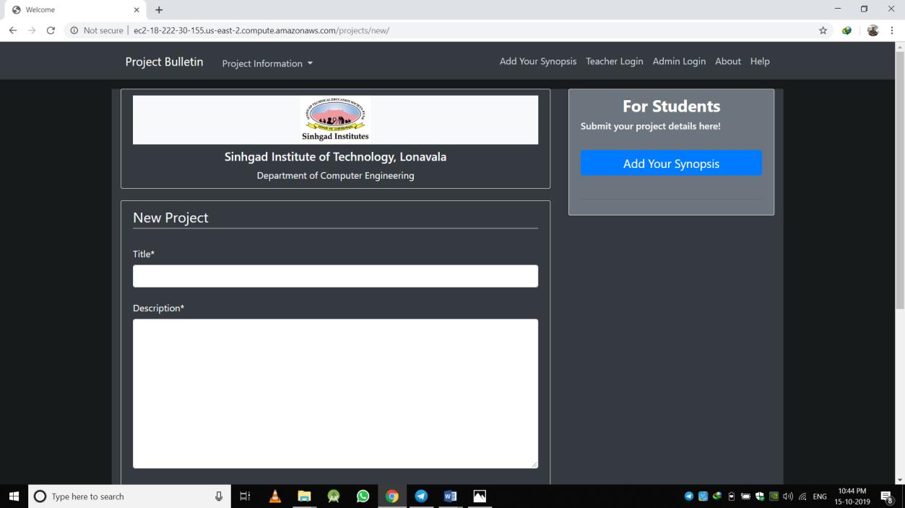
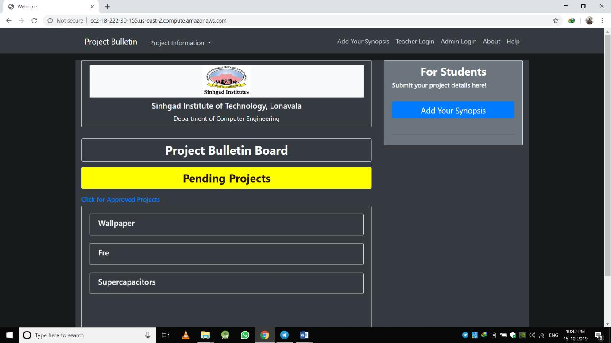
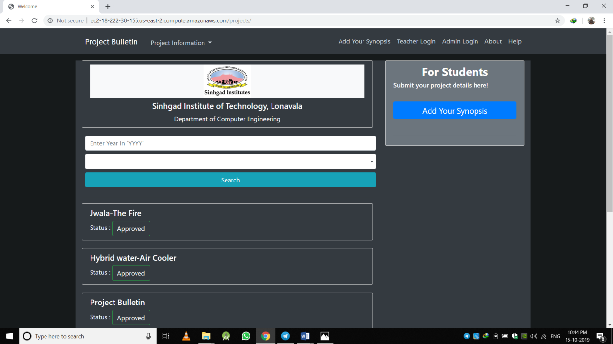
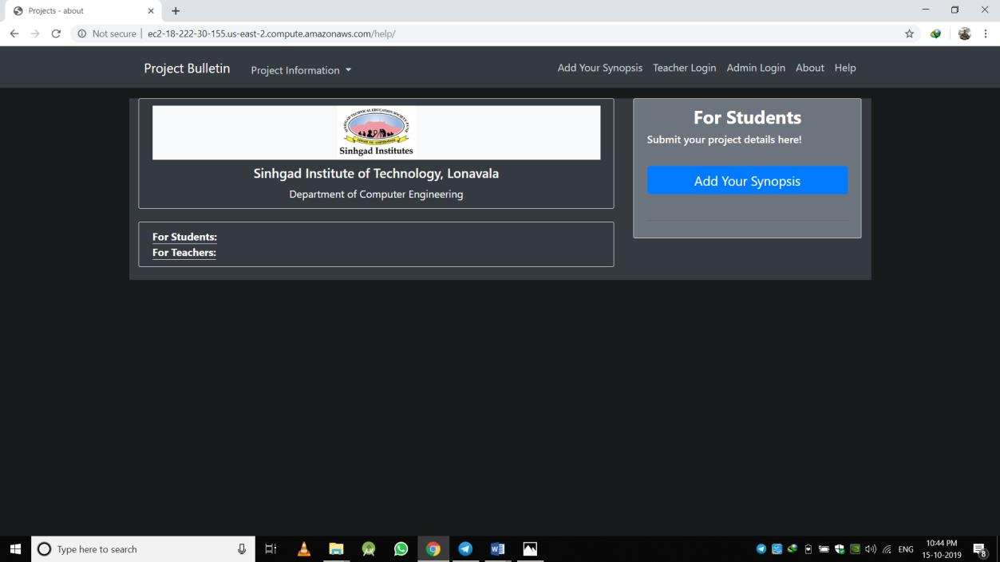
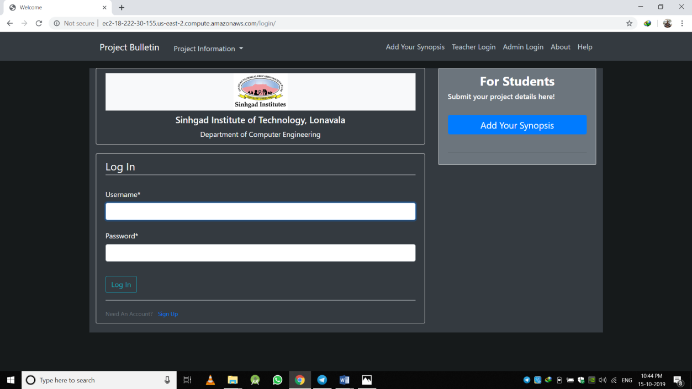
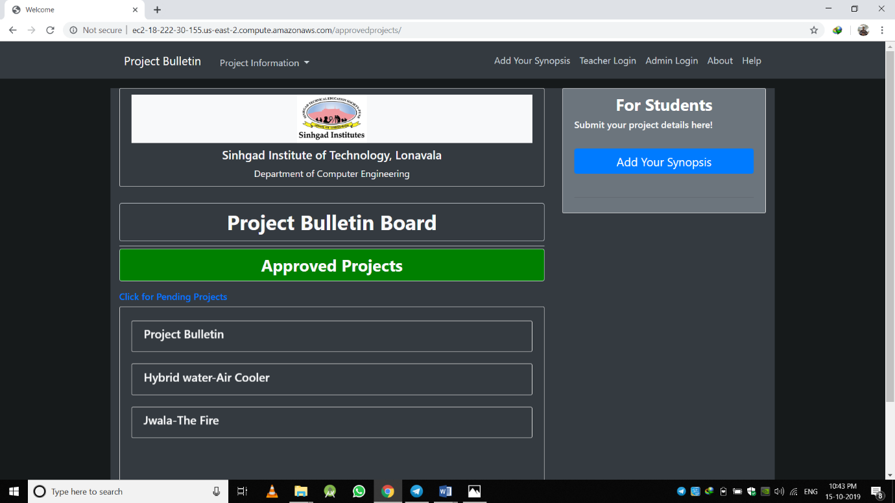
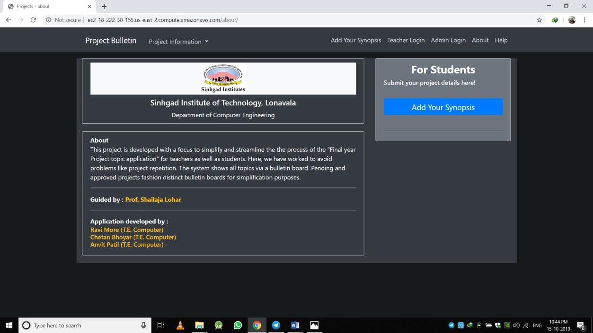
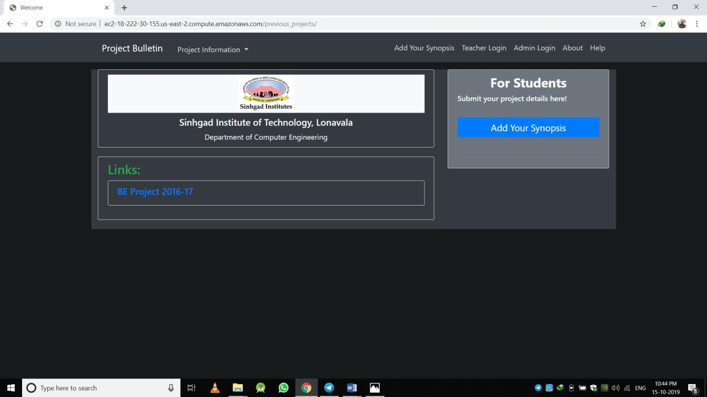

# Project Bulletin Board

## Overview

This project aims to streamline the process of student project submission and approval within an educational institution. It provides a user-friendly platform where students can submit project synopses, and teachers can efficiently review and approve these projects.

## Key Features

1. Student Project Submission:
Students can easily submit project synopses through the platform.
The system ensures clarity and avoids duplication by displaying submitted project titles.
2. Teacher Review and Approval:
Teachers have the ability to log in, review submitted projects, and provide approval.
This feature facilitates effective communication between students and teachers regarding project details.
3. Preventing Duplication:
The system helps prevent duplication of projects by displaying a comprehensive list of submitted project titles.
This ensures that students are aware of existing projects and can avoid redundancy in their submissions.
4. Centralized Administration:
The admin panel provides a centralized interface for administrators to manage users, permissions, and overall system configuration.
5. Important Links Section:
The platform includes a dedicated section for important links.
Students can access the latest notifications, resources, and updates, providing a valuable resource for their projects.

## How to Use

- Student Submission:
Students can submit their project synopses.
They can check existing project titles to avoid duplication.
- Teacher Approval:
Teachers log in to review and approve submitted projects.
Communication between students and teachers is streamlined through the platform.
- Admin Control:
Administrators utilize the admin panel to manage users, permissions, and system settings.
-Important Links:
The platform's Important Links section provides students with access to relevant resources and notifications.

## Benefits

- Efficiency: Streamlines the project submission and approval process.
- Communication: Facilitates clear communication between students and teachers.
- Prevention of Duplication: Averts the duplication of project titles through a comprehensive list.
- Resource Access: Provides students with important links for staying informed about relevant updates.

This project serves as a valuable tool for both students and teachers, enhancing the overall management of student projects within an educational institution.

## Getting started

### Requirements

- python 3.6
- MongoDB

### Virtual Environment

- Isolation of project dependencies
- Easy replication of the development environment
- Create a virtual environment:

   ```bash
   python -m venv venv
   ```

   Activate the virtual environment:
    On Windows:

    ```bash
    .\venv\Scripts\activate
    ```

   On Unix or MacOS:

    ```bash
    source venv/bin/activate
    ```

### Install Dependencies

- Install the project dependencies from requirements.txt:

    ```bash
    pip install -r requirements.txt
    ```

### Migrations

```bash
    python manage.py makemigrations
    python manage.py migrate
```

### Create superuser

```bash
    python manage.py createsuperuser
```

### Running the Django Project

- Ensure your virtual environment is activated.
- Navigate to the project directory where manage.py is located.
- Run the development server:

    ```bash
    python manage.py runserver
    ```

- Open your web browser and go to http://127.0.0.1:8000/ to access the project.

## Teacher User Creation by Admin

This feature streamlines the process of establishing teacher accounts within the system:

- User Creation:
  - Administrators log in to the admin panel.
    [Admin Login Page: http://127.0.0.1:8000/admin/login/](http://127.0.0.1:8000/admin/login/)
  - Create a user account for the teacher, providing necessary details.

- Granting Permissions:
  - Assign all relevant permissions to the teacher user, focusing on project approval and important link updates.

- Credentials Sharing:
  - Save the user information and share login credentials with the respective teacher.

- Utilization:
  - Teachers can now log in using their credentials.
  - They play a pivotal role in project approval and contribute to the system by updating important links.

## Screenshots










## Acknowledgments

A big thank you to the open-source community for their invaluable contributions and resources that have played a crucial role in making this project a reality.

## License

This project is licensed under the MIT License. For more information, refer to the [LICENSE](LICENSE) file.
